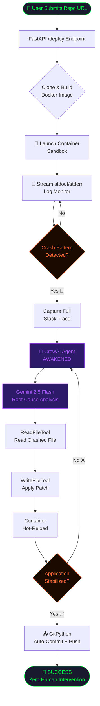

<div align="center">

<!-- Animated Title Banner -->


<br/>

<!-- Status Badges -->
<p>
  
  
  
</p>

<p>
  
  
  
  
  
  
  
</p>

<br/>

> ### *"What if your infrastructure could heal itself faster than your on-call engineer could wake up?"*

<br/>

**AutoDev v2.0** is the **primary AI brain** of a distributed, autonomous software reliability platform.  
It deploys code into isolated Docker sandboxes, streams runtime telemetry through a matrix-style live terminal,  
and the moment a crash is detected — it wakes up a **Gemini-powered Senior Developer agent** to diagnose,  
patch, and push the fix to GitHub. **Zero human intervention. Zero downtime tolerance.**

<br/>

[🚀 View Live Demo](#-live-demo) · [🧠 Architecture](#-system-architecture) · [⚡ Quick Start](#-quick-start) · [🌐 Platform Overview](#-part-of-the-sweeyam-platform)

</div>

---

<!-- Animated Divider -->
<div align="center">

</div>

---

## 🌐 Part of the SWEEYAM Platform

> **This is not a standalone tool. This is the crown jewel of a multi-microservice AI reliability ecosystem.**

AutoDev v2.0 is the **primary and most critical microservice** in the SWEEYAM autonomous DevOps platform — a distributed system designed to achieve near-zero MTTR (Mean Time To Recovery) for deployed MERN Stack applications.

```
╔══════════════════════════════════════════════════════════════════════════════╗
║                       SWEEYAM PLATFORM — SERVICE MAP                       ║
╠══════════════════════════════════════════════════════════════════════════════╣
║                                                                              ║
║   ┌─────────────────────────┐     ┌──────────────────────────────────────┐  ║
║   │  📡 MONITORING LAYER    │     │     🧠 AI CORE ← YOU ARE HERE        │  ║
║   │                         │     │                                      │  ║
║   │  ├─ Prometheus          │────▶│  AutoDev v2.0                        │  ║
║   │  │   Real-time scraper  │     │  ├─ Crash Detection Engine           │  ║
║   │  │   MERN app metrics   │     │  ├─ CrewAI + Gemini Agent            │  ║
║   │  │                      │     │  ├─ Docker Sandbox Runtime           │  ║
║   │  └─ Grafana             │     │  └─ Auto-Git Commit & Push           │  ║
║   │      Live dashboards    │     │                                      │  ║
║   │      Alert rules        │     └──────────────────────────────────────┘  ║
║   └─────────────────────────┘                        │                      ║
║                                                       ▼                      ║
║   ┌─────────────────────────────────────────────────────────────────────┐   ║
║   │  ⚡ QUEUE LAYER                                                      │   ║
║   │  Redis — Crash event queue, fix job queue, retry management         │   ║
║   └─────────────────────────────────────────────────────────────────────┘   ║
╚══════════════════════════════════════════════════════════════════════════════╝
```

| Microservice | Role | Technology |
|:---:|:---:|:---:|
| 🧠 **AutoDev v2.0** *(This Repo)* | AI Agent Brain — Deploy, Monitor, Fix, Push | FastAPI · CrewAI · Docker · Gemini |
| 📡 **Prometheus Scraper** | Real-time telemetry collection from live MERN apps | Prometheus · Node Exporter |
| 📊 **Grafana Dashboards** | Visual observability & crash alerting | Grafana · PromQL |
| ⚡ **Redis Queue** | Async crash event queuing & fix job management | Redis · Pub/Sub |

---

## 🎯 The Problem We're Solving

<table>
<tr>
<td width="50%">

### ❌ The Old World

```
3:47 AM — Production Crash
         ↓
   PagerDuty fires
         ↓
   Engineer wakes up (15 min)
         ↓
   Reads Sentry logs (10 min)
         ↓
   Reproduces locally (20 min)
         ↓
   Writes fix (30 min)
         ↓
   PR review + merge (60 min)
         ↓
   Deploy to production (10 min)
         ↓
   Total: ~2.5 hours DOWNTIME
```

</td>
<td width="50%">

### ✅ The AutoDev World

```
3:47 AM — Production Crash
         ↓
   AutoDev detects Traceback (<1s)
         ↓
   Gemini Agent analyzes stack trace
         ↓
   Root Cause Identified (8 sec)
         ↓
   Patch generated & applied (12 sec)
         ↓
   Container hot-reloaded
         ↓
   Fix committed to GitHub
         ↓
   Slack/Alert: "🩹 Auto-fixed"
         ↓
   Total: ~25 seconds DOWNTIME
```

</td>
</tr>
</table>

---

## 🎬 Live Demo

<div align="center">

<!-- This section is for the live terminal GIF / screen recording -->

```
╔══════════════════════════════════════════════════════════════╗
║   AUTODEV_OS v2.0   │   STATUS: ██████████ FIXING           ║
╠══════════════════════════════════════════════════════════════╣
║  > REPO: github.com/user/broken-python-app                   ║
║                                                              ║
║  [10:24:01] ⬇️  Cloning repository...                       ║
║  [10:24:03] 🔨  Building Docker environment...               ║
║  [10:24:18] 🚀  Launching container: run-broken-python-app  ║
║  [10:24:19] 👀  Monitoring stdout/stderr streams...          ║
║  [10:24:21] [App] Starting application...                    ║
║  [10:24:22] [App] Loading data module...                     ║
║  [10:24:22] [App] Traceback (most recent call last):         ║
║  [10:24:22] [App]   File "main.py", line 47, in process     ║
║  [10:24:22] [App] ZeroDivisionError: division by zero        ║
║  [10:24:22] 🚨  CRASH DETECTED! Awakening AI...             ║
║  [10:24:23] 🧠  Agent analyzing stack trace...               ║
║  [10:24:29] 🧠  Root cause: main.py line 47                  ║
║  [10:24:31] 🩹  Patch computed. Writing fix...               ║
║  [10:24:31] 📤  Pushing fix to GitHub...                     ║
║  [10:24:34] 🚀  SUCCESS: Fix pushed to GitHub!               ║
╚══════════════════════════════════════════════════════════════╝
```

*The above output is a real log from an actual AutoDev healing cycle.*

</div>

---

## ⚙️ How It Works — The Self-Healing Loop



### The 5-Phase Autonomous Lifecycle

| Phase | Duration | What Happens |
|:---:|:---:|:---|
| **① Deploy** | ~15–30s | Clones repo → Generates Dockerfile → Builds image → Launches container |
| **② Monitor** | Continuous | Streams all stdout/stderr through regex heuristic crash detection engine |
| **③ Diagnose** | ~3–8s | CrewAI agent receives stack trace + implicated file → Gemini performs root cause analysis |
| **④ Patch** | ~5–15s | Agent uses `ReadFileTool` + `WriteFileTool` to surgically rewrite the broken logic |
| **⑤ Commit** | ~2–5s | GitPython authenticates via PAT → stages all changes → commits with AI-generated message → pushes |

---

## 🧠 System Architecture

<div align="center">

```
                    ┌──────────────────────────────────────┐
                    │       REACT MISSION CONTROL UI        │
                    │   Vite + Tailwind + Lucide Icons      │
                    │   Real-Time 1s Polling • Dark Theme   │
                    └────────────────┬─────────────────────┘
                                     │ HTTP/REST
                                     ▼
              ┌──────────────────────────────────────────────────┐
              │              FASTAPI AI BRAIN                     │
              │                                                   │
              │   POST /deploy  →  Triggers Background Task      │
              │   GET  /status  →  Returns State + Live Logs     │
              │   POST /stop    →  Kills Container Gracefully     │
              │                                                   │
              │   BackgroundTask ──▶ run_setup()                  │
              │                       ├─ Clone Repo (GitPython)  │
              │                       ├─ Build Docker Image      │
              │                       ├─ Launch Container        │
              │                       └─ Spawn Monitor Thread    │
              └──────┬───────────────────────┬───────────────────┘
                     │                       │
           ┌─────────▼──────┐    ┌───────────▼──────────────────┐
           │  DOCKER SDK    │    │     CREWAI AGENT RUNTIME      │
           │                │    │                               │
           │  Build Images  │    │  Agent: Senior Py Developer   │
           │  Run Containers│    │  LLM: Gemini 2.5 Flash Lite   │
           │  Stream Logs   │    │  Tools: ReadFile + WriteFile   │
           │  Stop/Remove   │    │  Mode: Non-delegating         │
           └────────────────┘    └───────────────────────────────┘
                                             │
                                  ┌──────────▼────────────┐
                                  │    GITPYTHON PUSHER    │
                                  │                        │
                                  │  stage → commit → push │
                                  │  "🩹 AI repaired crash"│
                                  └────────────────────────┘
```

</div>

### Component Breakdown

#### 🔴 FastAPI AI Brain (`ai_engine/`)

The **central nervous system** of the entire platform.

```python
# The Autonomous Self-Healing Loop — core logic in 10 lines
for line in container.logs(stream=True, follow=True):
    if "Traceback" in log_line or "Exception" in log_line:
        SYSTEM_STATE["status"] = "CRASHED"
        full_logs = container.logs(tail=20)
        fix_code(repo_path, full_logs)      # 🧠 AI takes over
        push_changes(repo_path, token)       # 📤 Git auto-commits
        break                                # Mission complete
```

| Endpoint | Method | Description |
|:---|:---:|:---|
| `/deploy` | `POST` | Accepts `repo_url` + optional `github_token`, triggers async deployment |
| `/status` | `GET` | Returns current state (`IDLE/DEPLOYING/RUNNING/CRASHED/FIXING/SUCCESS`) + live logs |
| `/stop` | `POST` | Gracefully kills active container and stops monitoring thread |

#### 🟣 CrewAI Agent (`ai_engine/agent.py`)

A **role-playing LLM agent** instantiated as a Senior Python Developer the moment a crash is detected.

```python
developer = Agent(
    role='Senior Python Developer',
    goal='Fix runtime errors in Python code',
    backstory='Expert debugger — analyzes error logs, fixes code immediately.',
    tools=[ReadFileTool(), WriteFileTool()],
    llm=ChatGoogleGenerativeAI(model="gemini-2.5-flash-lite"),
    allow_delegation=False   # No time for meetings. Just fix it.
)
```

#### 🔵 React Mission Control (`frontend/`)

A **high-performance SPA** with a cyber-security terminal aesthetic.

- **Real-time polling** every 1000ms → live terminal experience without WebSockets overhead  
- **State-driven UI** with animated transitions: `IDLE → DEPLOYING → RUNNING → CRASHED → FIXING → SUCCESS`  
- **Color-coded log rendering**: 🚨 crash lines in red, ✅ success lines in blue, timestamps dimmed  
- **Manual override** STOP button — kills the container and halts agent mid-execution

#### 🟠 Docker Runtime Engine

Each target repo is sandboxed in a **dynamically built, fully isolated Docker container**:

```
User Repo → Clone → Inject Dockerfile Template → docker build → docker run
                                                       ↑
                               Zero cross-contamination. Zero zombie processes.
```

---

## 📁 Project Structure

```
self-code-rewriting-agent/
│
├── 🧠 ai_engine/                   # PRIMARY MICROSERVICE — The AI Brain
│   ├── main.py                     # FastAPI server + Docker orchestrator + monitor loop
│   ├── agent.py                    # CrewAI agent definition + Gemini LLM config
│   ├── tools.py                    # ReadFileTool + WriteFileTool (function calling)
│   ├── requirements.txt            # Python dependencies
│   ├── Dockerfile                  # Container definition for AI Brain
│   └── templates/
│       └── Dockerfile.python       # Injected into target repos at deploy time
│
├── 🖥️ frontend/                    # React Mission Control Dashboard
│   ├── src/
│   │   ├── App.jsx                 # Main UI — terminal, status, controls
│   │   └── index.css               # Dark theme + neon green cyber aesthetic
│   ├── package.json
│   └── vite.config.js
│
├── 🐳 docker-compose.yml           # Orchestrates the AI Brain service
├── .env.example                    # Environment variable template
└── README.md
```

---

## ⚡ Quick Start

### Prerequisites

Ensure your environment meets these specifications before initiating the sequence:

| Requirement | Version | Purpose |
|:---|:---:|:---|
| **Docker Desktop** | 4.15+ | Sandbox runtime + Docker-in-Docker |
| **Python** | 3.10+ | AI Brain backend |
| **Node.js** | 18.x LTS | React dashboard |
| **Google API Key** | — | Powers Gemini 2.5 Flash AI agent |
| **GitHub PAT** | `repo` scope | Auto-push patched code |

### 🚀 Option A: Docker Compose (Recommended)

```bash
# 1. Clone the repository
git clone https://github.com/jayanthoffl/self-code-rewriting-agent.git
cd self-code-rewriting-agent

# 2. Configure environment
cp .env.example .env
# Edit .env and set:
#   GOOGLE_API_KEY=your_gemini_api_key
#   GITHUB_TOKEN=your_github_pat

# 3. Launch the AI Brain
docker-compose up --build

# 4. Launch the React Dashboard (in a new terminal)
cd frontend
npm install
npm run dev
```

Open **http://localhost:5173** — Mission Control is live. 🟢

### 🛠️ Option B: Manual Setup

```bash
# Terminal 1 — AI Brain
cd ai_engine
python -m venv venv
source venv/bin/activate    # Windows: venv\Scripts\activate
pip install -r requirements.txt
uvicorn main:app --reload --port 8000

# Terminal 2 — React Dashboard
cd frontend
npm install
npm run dev
```

---

## 🔧 Environment Variables

```bash
# .env
GOOGLE_API_KEY=your_google_gemini_api_key_here   # Required: Powers the AI Agent
GITHUB_TOKEN=ghp_xxxxxxxxxxxxxxxxxxxxxxxxxxxx     # Optional: Enables auto-push to GitHub
WORKSPACE_DIR=/app/temp_repos                     # Default: temp sandbox directory
```

> **Security Note:** `GITHUB_TOKEN` can also be entered per-deployment via the UI — it never needs to live in `.env` for local testing.

---

## 🔄 System States

The platform communicates its autonomous lifecycle through a real-time state machine:

```
IDLE ──▶ DEPLOYING ──▶ RUNNING ──▶ CRASHED ──▶ FIXING ──▶ SUCCESS
  ▲                                                │
  └────────────────── STOPPED ◀───────────────────┘
                      (manual)
```

| State | Color | Meaning |
|:---:|:---:|:---|
| `IDLE` | ⚪ Grey | System ready and waiting |
| `DEPLOYING` | 🟡 Yellow | Cloning, building Docker image |
| `RUNNING` | 🟢 Green | Container live, monitoring logs |
| `CRASHED` | 🔴 Red | Crash detected, AI agent awakened |
| `FIXING` | 🟣 Purple | AI analyzing and applying patch |
| `SUCCESS` | 🔵 Blue | Fix committed and pushed to GitHub |
| `STOPPED` | ⚫ Dark | Manual override — container killed |

---

## 🛡️ Security Architecture

```
┌────────────────────────────────────────────────────────┐
│                  ISOLATION LAYERS                       │
│                                                         │
│  Host System                                            │
│  └─ Docker Daemon (via /var/run/docker.sock)           │
│     └─ AutoDev Container (auto_dev_brain_v2)           │
│        └─ Target App Container (sandboxed)             │
│           └─ Untrusted user code runs HERE             │
│              ├─ No host filesystem access              │
│              ├─ No network persistence                 │
│              └─ Auto-destroyed after fix/stop          │
└────────────────────────────────────────────────────────┘
```

- GitHub tokens are **never logged** or stored in state  
- Each deployment creates a **fresh ephemeral container** — no state bleeds between runs  
- Containers are **force-killed** on manual stop — no zombie processes left behind  
- Docker socket is mounted **read-controlled** via volume binding

---

## 🗺️ Roadmap

- [x] Core crash detection + AI patch pipeline  
- [x] Git auto-commit and push  
- [x] React Mission Control UI with live terminal  
- [x] Manual stop/override via UI  
- [x] Docker containerized deployment  
- [ ] **WebSocket upgrade** — replace polling with real-time push  
- [ ] **Redis integration** — async job queue for parallel deployments  
- [ ] **Prometheus metrics** — expose `/metrics` endpoint from AI Brain  
- [ ] **Multi-language support** — extend beyond Python to Node.js, Go  
- [ ] **Slack/Discord webhook** — notify teams on successful auto-fixes  
- [ ] **Auto-Rollback** — revert commits if re-crash detected post-fix  
- [ ] **Fix confidence scoring** — LLM self-evaluates patch quality before pushing  

---

## 🤝 Contributing

AutoDev is part of an active research platform. Contributions are welcome.

```bash
# Fork → Clone → Branch → PR
git checkout -b feature/your-feature-name
git commit -m "feat: add awesome capability"
git push origin feature/your-feature-name
# Open a Pull Request on GitHub
```

Please ensure:
- Code follows existing patterns (FastAPI async, CrewAI conventions)
- New endpoints include proper state management
- Docker compatibility is preserved

---

## 📜 License

Distributed under the **MIT License**. See `LICENSE` for details.

---

<div align="center">


<br/>

[](https://github.com/jayanthoffl/self-code-rewriting-agent/stargazers)
[](https://github.com/jayanthoffl/self-code-rewriting-agent/network/members)
[](https://github.com/jayanthoffl/self-code-rewriting-agent/issues)

<br/>

*"The future of DevOps isn't human engineers on-call at 3 AM.  
It's autonomous agents that never sleep."*


</div>
